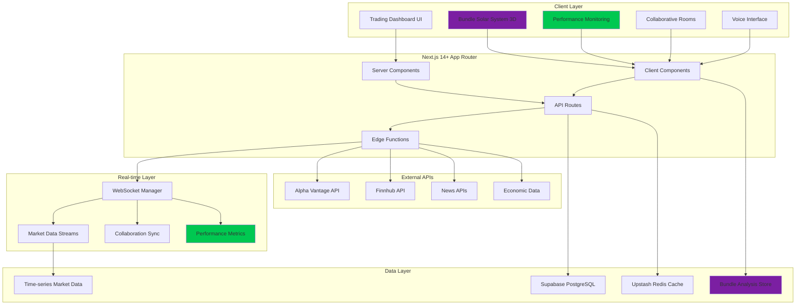

# Performance Learning Trading Platform Fullstack Architecture Document

This document outlines the complete fullstack architecture for the Performance Learning Trading Platform, including real-time trading functionality, advanced market visualizations, collaborative features, and integrated performance optimization learning tools. It serves as the single source of truth for AI-driven development, ensuring consistency across the entire technology stack.

This unified approach combines traditional trading platform architecture with innovative performance learning tools, creating a unique system that serves both as a functional trading dashboard and a comprehensive performance optimization education platform.

## Introduction

### Starter Template or Existing Project

**Analysis Source:** New greenfield project with Next.js 14+ App Router foundation

**Starter Template Decision:** 
- **Primary Template**: Next.js 14+ with App Router (create-next-app@latest)
- **Trading Enhancement**: Integration with financial data APIs and real-time streaming
- **Performance Learning**: Custom performance monitoring and Bundle Size Solar System integration
- **3D Visualization**: Three.js integration for advanced market depth and bundle visualization

**Rationale for Next.js Foundation:**
- Built-in performance optimization features align with learning objectives
- Server/Client Component architecture perfect for trading data optimization
- Edge functions support real-time financial data processing
- Integrated bundle analysis supports Bundle Size Solar System development
- Production-ready deployment on Vercel with performance insights

### Change Log
| Date | Version | Description | Author |
|------|---------|-------------|--------|
| Today | 1.0 | Initial fullstack architecture for performance learning trading platform | Winston (Architect) |

## High Level Architecture

### Technical Summary

The Performance Learning Trading Platform employs a **hybrid client-server architecture** built on Next.js 14+ App Router, designed to support both professional trading workflows and systematic performance optimization learning. The system integrates real-time financial data streaming with advanced 3D visualizations, collaborative trading rooms, and the signature Bundle Size Solar System performance learning tool.

The architecture strategically separates performance-critical trading functions (portfolio tracking, real-time data) from performance learning tools (bundle analysis, optimization demonstrations), enabling deliberate performance bottlenecks in learning components while maintaining professional-grade responsiveness in core trading features. The system scales from deliberately unoptimized baseline through six systematic optimization phases, culminating in production-ready performance suitable for professional trading platforms.

### Platform and Infrastructure Choice

**Platform:** Vercel + Supabase + Upstash for optimal Next.js integration and real-time performance

**Key Services:**
- **Vercel**: Edge deployment, performance insights, bundle analysis integration
- **Supabase**: PostgreSQL + real-time subscriptions for portfolio and social features
- **Upstash Redis**: High-performance caching for market data and session management
- **WebSocket Services**: Custom real-time infrastructure for collaborative features and market streaming

**Deployment Host and Regions:** Global edge deployment with primary regions in US-East (financial data proximity) and EU-West (global accessibility)

**Rationale:** This stack provides native performance monitoring integration essential for learning objectives while supporting enterprise-grade trading platform requirements.

### Repository Structure

**Structure:** Monorepo with performance-optimized workspace organization

**Monorepo Tool:** Turborepo for build optimization and bundle analysis integration

**Package Organization:** Feature-based separation enabling independent performance optimization and clear Bundle Size Solar System integration

```
trading-platform/
├── apps/
│   ├── web/                    # Next.js 14+ trading platform
│   └── api/                    # Standalone API services (optional)
├── packages/
│   ├── ui/                     # Shared component library
│   ├── trading-core/           # Trading logic and calculations
│   ├── performance-tools/      # Bundle analysis and optimization tools
│   └── shared/                 # Common utilities and types
```

### High Level Architecture Diagram



### Architectural Patterns

- **Hybrid Rendering Pattern**: Strategic Server/Client Component separation for optimal trading performance - *Rationale:* Trading data benefits from server-side optimization while interactive features require client-side responsiveness
- **Real-time Streaming Architecture**: WebSocket-based streaming with intelligent fallbacks for market data - *Rationale:* Financial data requires sub-second latency with reliable delivery guarantees
- **Progressive Enhancement Pattern**: Performance learning features enhance core trading without blocking functionality - *Rationale:* Maintains professional trading capability while enabling systematic performance education
- **Component-Based Microfrontend**: Modular architecture enabling independent optimization of trading vs learning features - *Rationale:* Allows deliberate performance bottlenecks in learning components without affecting trading performance
- **Event-Driven Collaboration**: Real-time collaboration using event sourcing for conflict resolution - *Rationale:* Multiple users require consistent state synchronization with performance optimization opportunities

## Tech Stack

This is the DEFINITIVE technology selection for the entire Performance Learning Trading Platform. These exact versions and tools will be used throughout all development phases and optimization learning.

### Technology Stack Table

| Category | Technology | Version | Purpose | Rationale |
|----------|------------|---------|---------|-----------|
| **Frontend Language** | TypeScript | 5.3.3 | Type safety across trading and performance components | Essential for complex financial calculations and Bundle Size Solar System 3D interactions |
| **Frontend Framework** | Next.js | 14.0.4 | Full-stack React framework with App Router | Built-in performance optimization features align perfectly with learning objectives |
| **UI Component Library** | Radix UI Primitives | 1.0.4 | Headless accessible components | Performance-optimized foundation for custom trading interface design |
| **State Management** | Zustand | 4.4.7 | Lightweight state management | Minimal bundle impact while supporting complex trading and 3D visualization state |
| **Backend Language** | Node.js | 20.11.0 | JavaScript runtime for API routes | Unified language stack enabling shared types between frontend and backend |
| **Backend Framework** | Next.js API Routes | 14.0.4 | Serverless API endpoints | Integrated with frontend framework, optimal for trading data processing |
| **API Style** | REST + WebSocket | HTTP/1.1 + WS | Hybrid API approach | REST for standard operations, WebSocket for real-time market data and collaboration |
| **Database** | PostgreSQL | 15.0 | Primary data storage via Supabase | ACID compliance for financial data, time-series support for market data |
| **Cache** | Upstash Redis | 7.0 | High-performance caching | Sub-millisecond latency for real-time trading data and session management |
| **File Storage** | Vercel Blob | Latest | Bundle analysis and performance reports | Integrated with deployment platform, CDN optimization for static assets |
| **Authentication** | NextAuth.js | 4.24.5 | Authentication and session management | Secure trading platform access with multiple provider support |
| **Frontend Testing** | Vitest + Testing Library | 1.1.0 + 14.0.0 | Component and integration testing | Fast testing aligned with performance optimization learning |
| **Backend Testing** | Vitest + Supertest | 1.1.0 + 6.3.3 | API endpoint testing | Unified testing framework across fullstack application |
| **E2E Testing** | Playwright | 1.40.0 | End-to-end trading workflow testing | Cross-browser testing with performance monitoring integration |
| **Build Tool** | Turbo | 1.11.0 | Monorepo build optimization | Essential for Bundle Size Solar System development and optimization learning |
| **Bundler** | Webpack | 5.89.0 | JavaScript bundling via Next.js | Bundle analysis integration for Solar System visualization and optimization tracking |
| **IaC Tool** | Vercel CLI | 32.0.0 | Infrastructure as Code | Simplified deployment with performance insights integration |
| **CI/CD** | GitHub Actions | Latest | Continuous integration and deployment | Performance regression testing and bundle analysis automation |
| **Monitoring** | Vercel Analytics + Custom | Latest + Custom | Real User Monitoring and performance tracking | Essential for learning objectives and Core Web Vitals optimization |
| **Logging** | Vercel Logs + Winston | Latest + 3.11.0 | Application logging and debugging | Performance-aware logging with minimal impact on Core Web Vitals |
| **CSS Framework** | Tailwind CSS | 3.4.0 | Utility-first styling | Performance-optimized styling with JIT compilation and minimal bundle impact |
| **3D Graphics** | Three.js + React Three Fiber | 0.158.0 + 8.15.0 | Bundle Size Solar System and 3D market depth | Advanced 3D visualization with React integration for performance learning |
| **Charts/Visualization** | Chart.js + D3.js | 4.4.0 + 7.8.5 | Trading charts and data visualization | Progression from heavy Chart.js to optimized D3.js for performance learning |
| **Real-time Communication** | Socket.io | 4.7.4 | WebSocket management and collaboration | Reliable real-time features with performance optimization opportunities |
| **Voice Recognition** | Web Speech API | Native | Voice trading commands | Browser-native API with Web Worker optimization for performance learning |
| **Form Handling** | React Hook Form | 7.48.2 | Trading forms and user input | Performance-optimized form handling with minimal re-renders |
| **Animation** | Framer Motion | 10.16.16 | UI animations and performance demonstrations | Initially heavy for learning, then optimized to demonstrate animation performance |
| **Date/Time** | date-fns | 2.30.0 | Financial data time handling | Lightweight alternative to moment.js for bundle optimization learning |
| **Validation** | Zod | 3.22.4 | Runtime type validation | Type-safe API validation for financial data with performance considerations |
| **Styling Solution** | CSS Modules + Tailwind | Native + 3.4.0 | Hybrid styling approach | Demonstrates styling optimization progression for performance learning |

## Data Models

### Core Trading Data Models

#### Stock
**Purpose:** Fundamental stock data and real-time market information for all trading operations

**Key Attributes:**
- symbol: string - Stock ticker symbol (e.g., "AAPL", "GOOGL")
- name: string - Company name for display and search
- currentPrice: number - Real-time stock price with microsecond precision
- priceChange: number - Daily price change for P&L calculations
- volume: number - Trading volume for liquidity analysis
- marketCap: number - Market capitalization for screening and analysis

**Relationships:**
- **With Portfolio**: One-to-many relationship for position tracking
- **With MarketData**: One-to-many for historical pricing and time-series analysis
- **With SocialPost**: Many-to-many for stock mentions and sentiment tracking

```typescript
interface Stock {
  id: string;
  symbol: string;
  name: string;
  currentPrice: number;
  priceChange: number;
  priceChangePercent: number;
  volume: number;
  marketCap: number;
  sector: string;
  lastUpdated: Date;
  metadata: {
    exchange: string;
    currency: string;
    timezone: string;
  };
}
```

## API Specification

**REST API + WebSocket Hybrid Architecture** for optimal trading platform performance with real-time capabilities

### REST API Endpoints

```yaml
openapi: 3.0.0
info:
  title: Performance Learning Trading Platform API
  version: 1.0.0
  description: Comprehensive trading platform API with integrated performance learning tools

servers:
  - url: https://trading-platform.vercel.app/api
    description: Production API server
  - url: http://localhost:3000/api  
    description: Development server

paths:
  # Trading Core APIs
  /stocks:
    get:
      summary: Get stock data with real-time pricing
      parameters:
        - name: symbols
          in: query
          schema:
            type: string
          description: Comma-separated stock symbols (e.g., "AAPL,GOOGL,TSLA")
        - name: includeMetrics
          in: query
          schema:
            type: boolean
          description: Include performance metrics for optimization learning
      responses:
        200:
          description: Stock data with performance metrics
          content:
            application/json:
              schema:
                type: object
                properties:
                  stocks:
                    type: array
                    items:
                      $ref: '#/components/schemas/Stock'
                  performanceMetrics:
                    $ref: '#/components/schemas/ApiPerformanceMetrics'

  /stocks/{symbol}/chart:
    get:
      summary: Get historical chart data for trading analysis
      parameters:
        - name: symbol
          in: path
          required: true
          schema:
            type: string
        - name: timeframe
          in: query
          schema:
            type: string
            enum: [1m, 5m, 15m, 1h, 1d, 1w]
        - name: period
          in: query
          schema:
            type: string
            enum: [1d, 5d, 1mo, 3mo, 6mo, 1y, 2y]
      responses:
        200:
          description: Historical chart data optimized for rendering
          content:
            application/json:
              schema:
                type: object
                properties:
                  symbol:
                    type: string
                  data:
                    type: array
                    items:
                      type: object
                      properties:
                        timestamp: 
                          type: string
                          format: date-time
                        open: 
                          type: number
                        high: 
                          type: number
                        low: 
                          type: number
                        close: 
                          type: number
                        volume: 
                          type: number

  # Portfolio Management APIs
  /portfolios:
    get:
      summary: Get user portfolios with real-time valuations
      responses:
        200:
          description: User portfolios with performance tracking
          content:
            application/json:
              schema:
                type: array
                items:
                  $ref: '#/components/schemas/Portfolio'
    post:
      summary: Create new portfolio
      requestBody:
        required: true
        content:
          application/json:
            schema:
              type: object
              properties:
                name:
                  type: string
                description:
                  type: string
      responses:
        201:
          description: Portfolio created successfully

  /portfolios/{portfolioId}/positions:
    get:
      summary: Get portfolio positions with real-time P&L
      parameters:
        - name: portfolioId
          in: path
          required: true
          schema:
            type: string
      responses:
        200:
          description: Portfolio positions with performance metrics
          content:
            application/json:
              schema:
                type: array
                items:
                  $ref: '#/components/schemas/Position'

    post:
      summary: Add position to portfolio (simulated trading)
      parameters:
        - name: portfolioId
          in: path
          required: true
          schema:
            type: string
      requestBody:
        required: true
        content:
          application/json:
            schema:
              type: object
              properties:
                symbol:
                  type: string
                quantity:
                  type: number
                price:
                  type: number
                type:
                  type: string
                  enum: [buy, sell]
      responses:
        201:
          description: Position added successfully

  # Performance Learning APIs
  /performance/bundles:
    get:
      summary: Get Bundle Size Solar System data for current optimization phase
      parameters:
        - name: phase
          in: query
          schema:
            type: integer
            minimum: 0
            maximum: 6
      responses:
        200:
          description: Bundle analysis data for Solar System visualization
          content:
            application/json:
              schema:
                $ref: '#/components/schemas/BundleAnalysis'

    post:
      summary: Store bundle analysis results for optimization tracking
      requestBody:
        required: true
        content:
          application/json:
            schema:
              $ref: '#/components/schemas/BundleAnalysis'
      responses:
        201:
          description: Bundle analysis stored successfully

  /performance/metrics:
    get:
      summary: Get performance metrics timeline for learning progress
      parameters:
        - name: startDate
          in: query
          schema:
            type: string
            format: date
        - name: endDate
          in: query
          schema:
            type: string
            format: date
        - name: phase
          in: query
          schema:
            type: integer
      responses:
        200:
          description: Performance metrics with optimization progression
          content:
            application/json:
              schema:
                type: array
                items:
                  $ref: '#/components/schemas/PerformanceMetrics'

    post:
      summary: Record real-time performance metrics
      requestBody:
        required: true
        content:
          application/json:
            schema:
              $ref: '#/components/schemas/PerformanceMetrics'
      responses:
        201:
          description: Performance metrics recorded

  # Social Trading APIs
  /social/posts:
    get:
      summary: Get social trading feed with infinite scroll support
      parameters:
        - name: cursor
          in: query
          schema:
            type: string
          description: Pagination cursor for infinite scroll
        - name: limit
          in: query
          schema:
            type: integer
            default: 20
        - name: filter
          in: query
          schema:
            type: string
            enum: [all, following, trending]
      responses:
        200:
          description: Social trading posts with pagination
          content:
            application/json:
              schema:
                type: object
                properties:
                  posts:
                    type: array
                    items:
                      $ref: '#/components/schemas/SocialPost'
                  nextCursor:
                    type: string
                  hasMore:
                    type: boolean

    post:
      summary: Create new social trading post
      requestBody:
        required: true
        content:
          application/json:
            schema:
              type: object
              properties:
                content:
                  type: string
                stockMentions:
                  type: array
                  items:
                    type: string
                mediaUrls:
                  type: array
                  items:
                    type: string
      responses:
        201:
          description: Social post created successfully

  # Collaborative Trading APIs
  /collaborative/rooms:
    get:
      summary: Get available collaborative trading rooms
      responses:
        200:
          description: List of collaborative rooms with participant counts
          content:
            application/json:
              schema:
                type: array
                items:
                  $ref: '#/components/schemas/CollaborativeRoom'

    post:
      summary: Create new collaborative trading room
      requestBody:
        required: true
        content:
          application/json:
            schema:
              type: object
              properties:
                name:
                  type: string
                description:
                  type: string
                maxParticipants:
                  type: integer
                settings:
                  type: object
      responses:
        201:
          description: Collaborative room created successfully

  /collaborative/rooms/{roomId}/annotations:
    get:
      summary: Get room annotations for chart synchronization
      parameters:
        - name: roomId
          in: path
          required: true
          schema:
            type: string
      responses:
        200:
          description: Room annotations with real-time sync data
          content:
            application/json:
              schema:
                type: array
                items:
                  $ref: '#/components/schemas/Annotation'

    post:
      summary: Add annotation to collaborative room
      parameters:
        - name: roomId
          in: path
          required: true
          schema:
            type: string
      requestBody:
        required: true
        content:
          application/json:
            schema:
              $ref: '#/components/schemas/Annotation'
      responses:
        201:
          description: Annotation added successfully

components:
  schemas:
    Stock:
      type: object
      properties:
        id:
          type: string
        symbol:
          type: string
        name:
          type: string
        currentPrice:
          type: number
        priceChange:
          type: number
        volume:
          type: number
        lastUpdated:
          type: string
          format: date-time

    Portfolio:
      type: object
      properties:
        id:
          type: string
        userId:
          type: string
        name:
          type: string
        totalValue:
          type: number
        totalGainLoss:
          type: number
        positions:
          type: array
          items:
            $ref: '#/components/schemas/Position'

    Position:
      type: object
      properties:
        id:
          type: string
        symbol:
          type: string
        quantity:
          type: number
        averageCost:
          type: number
        currentValue:
          type: number
        unrealizedGainLoss:
          type: number

    BundleAnalysis:
      type: object
      properties:
        id:
          type: string
        phase:
          type: integer
        bundles:
          type: array
          items:
            type: object
        totalSize:
          type: number
        optimizationImpact:
          type: array
          items:
            type: object

    PerformanceMetrics:
      type: object
      properties:
        id:
          type: string
        timestamp:
          type: string
          format: date-time
        coreWebVitals:
          type: object
        customMetrics:
          type: object

    ApiPerformanceMetrics:
      type: object
      properties:
        responseTime:
          type: number
        dbQueryTime:
          type: number
        cacheHitRate:
          type: number
```

### WebSocket API Specification

**Real-time Event Architecture** for trading data streaming and collaborative features

**Connection Endpoints:**
- `ws://localhost:3000/api/ws/market-data` - Real-time stock price streaming
- `ws://localhost:3000/api/ws/collaboration` - Collaborative room synchronization
- `ws://localhost:3000/api/ws/performance` - Live performance metrics streaming

**Market Data WebSocket Events:**
```typescript
// Client → Server
interface SubscribeToSymbols {
  type: 'subscribe';
  symbols: string[];
  updateFrequency: 1000 | 2000 | 5000; // milliseconds
}

interface UnsubscribeFromSymbols {
  type: 'unsubscribe';
  symbols: string[];
}

// Server → Client  
interface StockPriceUpdate {
  type: 'price-update';
  symbol: string;
  price: number;
  change: number;
  volume: number;
  timestamp: Date;
}

interface MarketDataBatch {
  type: 'batch-update';
  updates: StockPriceUpdate[];
  batchSize: number;
  processingTime: number; // For performance learning
}
```

**Collaborative WebSocket Events:**
```typescript
// User presence and cursor tracking
interface UserPresence {
  type: 'user-presence';
  roomId: string;
  userId: string;
  cursor: { x: number; y: number } | null;
  isActive: boolean;
}

// Real-time annotation synchronization
interface AnnotationUpdate {
  type: 'annotation-update';
  roomId: string;
  annotation: Annotation;
  action: 'create' | 'update' | 'delete';
  authorId: string;
  timestamp: Date;
}

// Voice activity for collaborative features
interface VoiceActivity {
  type: 'voice-activity';
  roomId: string;
  userId: string;
  isActive: boolean;
  audioLevel?: number;
}
```

**Performance Metrics WebSocket Events:**
```typescript
// Real-time performance monitoring
interface PerformanceUpdate {
  type: 'performance-update';
  metrics: PerformanceMetrics;
  phase: number;
  improvements: OptimizationImpact[];
}

// Bundle Size Solar System updates
interface BundleUpdate {
  type: 'bundle-update';
  analysis: BundleAnalysis;
  visualizationData: PlanetData[];
  optimizationSuggestions: string[];
}
```

#### Portfolio
**Purpose:** User portfolio management with real-time P&L tracking and performance analysis

**Key Attributes:**
- userId: string - Owner reference for multi-user platform
- positions: Position[] - Array of current stock positions
- totalValue: number - Real-time portfolio valuation
- totalGainLoss: number - Overall P&L calculation
- lastUpdated: Date - Performance tracking for calculation optimization

**Relationships:**
- **With User**: Many-to-one relationship for user portfolio management
- **With Position**: One-to-many for detailed position tracking
- **With PerformanceMetrics**: One-to-many for optimization impact measurement

```typescript
interface Portfolio {
  id: string;
  userId: string;
  name: string;
  positions: Position[];
  totalValue: number;
  totalCost: number;
  totalGainLoss: number;
  totalGainLossPercent: number;
  lastUpdated: Date;
  performanceMetrics: {
    calculationTime: number;
    renderTime: number;
    dataFreshness: number;
  };
}
```

#### Position
**Purpose:** Individual stock positions within portfolios with detailed performance tracking

**Key Attributes:**
- symbol: string - Stock symbol reference
- quantity: number - Number of shares owned
- averageCost: number - Average cost basis for P&L calculations
- currentValue: number - Real-time position value
- unrealizedGainLoss: number - Current P&L calculation

**Relationships:**
- **With Portfolio**: Many-to-one for portfolio aggregation
- **With Stock**: Many-to-one for real-time pricing
- **With Transaction**: One-to-many for trade history

```typescript
interface Position {
  id: string;
  portfolioId: string;
  symbol: string;
  quantity: number;
  averageCost: number;
  currentPrice: number;
  currentValue: number;
  unrealizedGainLoss: number;
  unrealizedGainLossPercent: number;
  dayGainLoss: number;
  lastUpdated: Date;
}
```

### Performance Learning Data Models

#### BundleAnalysis
**Purpose:** Bundle Size Solar System data model for performance optimization learning

**Key Attributes:**
- phase: number - Optimization phase (0-6) for Solar System visualization
- bundles: BundleData[] - Individual bundle analysis for planet generation
- totalSize: number - Aggregate bundle size for optimization tracking
- optimizationImpact: OptimizationMetric[] - Performance improvement measurements

**Relationships:**
- **With PerformancePhase**: Many-to-one for optimization progression tracking
- **With User**: Many-to-one for personalized learning progress

```typescript
interface BundleAnalysis {
  id: string;
  userId: string;
  phase: 0 | 1 | 2 | 3 | 4 | 5 | 6;
  timestamp: Date;
  bundles: {
    name: string;
    size: number;
    gzippedSize: number;
    files: string[];
    dependencies: string[];
    optimizations: string[];
    planetPosition: { x: number; y: number; z: number };
  }[];
  totalSize: number;
  previousPhaseSize?: number;
  optimizationImpact: {
    metric: 'lcp' | 'fid' | 'cls' | 'bundle-size' | 'render-time';
    before: number;
    after: number;
    improvement: number;
  }[];
}
```

#### PerformanceMetrics
**Purpose:** Real-time Core Web Vitals and custom performance tracking for learning progress

**Key Attributes:**
- timestamp: Date - Measurement time for trend analysis
- coreWebVitals: CoreWebVitals - Standard Google metrics
- customMetrics: CustomMetrics - Application-specific performance data
- phase: number - Current optimization phase context

**Relationships:**
- **With User**: Many-to-one for personalized performance tracking
- **With BundleAnalysis**: One-to-one for optimization correlation analysis

```typescript
interface PerformanceMetrics {
  id: string;
  userId: string;
  timestamp: Date;
  url: string;
  phase: number;
  coreWebVitals: {
    lcp: number; // Largest Contentful Paint
    fid: number; // First Input Delay  
    cls: number; // Cumulative Layout Shift
    ttfb: number; // Time to First Byte
    fcp: number; // First Contentful Paint
  };
  customMetrics: {
    bundleSize: number;
    renderTime: number;
    memoryUsage: number;
    networkRequests: number;
    chartRenderTime: number;
    heatMapRenderTime: number;
    portfolioCalculationTime: number;
  };
  deviceInfo: {
    type: 'mobile' | 'tablet' | 'desktop';
    connection: string;
    memory?: number;
  };
}
```

### Social Trading Data Models

#### User
**Purpose:** User profiles with trading and performance learning preferences

**Key Attributes:**
- email: string - Authentication and communication
- tradingPreferences: TradingPreferences - Personalized trading settings
- learningProgress: LearningProgress - Performance optimization advancement
- socialProfile: SocialProfile - Community interaction data

**Relationships:**
- **With Portfolio**: One-to-many for multiple portfolio management
- **With SocialPost**: One-to-many for community contributions
- **With CollaborativeRoom**: Many-to-many for trading room participation

```typescript
interface User {
  id: string;
  email: string;
  username: string;
  profileImage?: string;
  tradingPreferences: {
    defaultTimeframe: string;
    watchlist: string[];
    riskTolerance: 'conservative' | 'moderate' | 'aggressive';
    notificationSettings: NotificationSettings;
  };
  learningProgress: {
    currentPhase: number;
    completedOptimizations: string[];
    performanceAchievements: Achievement[];
    portfolioReadiness: number; // 0-100 score
  };
  socialProfile: {
    followersCount: number;
    followingCount: number;
    tradingReputation: number;
    collaborativeRoomsJoined: string[];
  };
  createdAt: Date;
  lastActive: Date;
}
```

#### SocialPost
**Purpose:** Social trading feed with real-time interactions and performance optimization challenges

**Key Attributes:**
- content: string - Post text content with trading insights
- stockMentions: string[] - Referenced stock symbols for sentiment analysis
- mediaUrls: string[] - Images, charts, and video attachments
- interactions: PostInteraction[] - Likes, comments, shares with real-time updates

**Relationships:**
- **With User**: Many-to-one for post authorship
- **With Stock**: Many-to-many for stock mentions and sentiment tracking
- **With PostInteraction**: One-to-many for engagement tracking

```typescript
interface SocialPost {
  id: string;
  userId: string;
  content: string;
  stockMentions: string[];
  mediaUrls: string[];
  interactions: {
    likes: number;
    comments: number;
    shares: number;
    lastUpdated: Date;
  };
  sentiment: 'bullish' | 'bearish' | 'neutral';
  visibility: 'public' | 'followers' | 'room';
  createdAt: Date;
  updatedAt: Date;
  performanceImpact: {
    renderTime: number;
    bundleImpact: number;
    memoryUsage: number;
  };
}
```

### Collaborative Trading Data Models

#### CollaborativeRoom
**Purpose:** Shared trading analysis workspace with real-time synchronization and performance optimization

**Key Attributes:**
- name: string - Room identification for user navigation
- participants: User[] - Active users with presence tracking
- sharedState: SharedRoomState - Synchronized trading analysis data
- annotations: Annotation[] - Real-time chart annotations and drawings

**Relationships:**
- **With User**: Many-to-many for room participation
- **With Annotation**: One-to-many for shared chart analysis
- **With VoiceSession**: One-to-one for audio collaboration

```typescript
interface CollaborativeRoom {
  id: string;
  name: string;
  description: string;
  createdBy: string;
  participants: {
    userId: string;
    joinedAt: Date;
    isActive: boolean;
    cursor: { x: number; y: number } | null;
    voiceActive: boolean;
  }[];
  sharedState: {
    focusedStock: string | null;
    chartTimeframe: string;
    annotations: Annotation[];
    lastUpdated: Date;
    conflictResolution: ConflictData[];
  };
  settings: {
    maxParticipants: number;
    voiceEnabled: boolean;
    annotationsEnabled: boolean;
    performanceOptimized: boolean;
  };
  performanceMetrics: {
    syncLatency: number;
    participantLimit: number;
    bandwidthUsage: number;
  };
  createdAt: Date;
}
```

#### Annotation
**Purpose:** Real-time chart annotations for collaborative analysis with performance optimization

**Key Attributes:**
- type: string - Annotation type (line, circle, text, arrow)
- coordinates: Coordinates - Position data for chart overlay
- style: AnnotationStyle - Visual styling with performance considerations
- authorId: string - User identification for conflict resolution

**Relationships:**
- **With User**: Many-to-one for annotation authorship
- **With CollaborativeRoom**: Many-to-one for room organization
- **With Stock**: Many-to-one for symbol-specific annotations

```typescript
interface Annotation {
  id: string;
  roomId: string;
  authorId: string;
  type: 'line' | 'rectangle' | 'circle' | 'text' | 'arrow' | 'freehand';
  coordinates: {
    startX: number;
    startY: number;
    endX?: number;
    endY?: number;
    points?: { x: number; y: number }[]; // For freehand
  };
  style: {
    color: string;
    thickness: number;
    opacity: number;
    dashed: boolean;
  };
  content?: string; // For text annotations
  symbol: string; // Associated stock symbol
  timeframe: string; // Chart timeframe context
  createdAt: Date;
  updatedAt: Date;
  optimizationData: {
    renderTime: number;
    syncTime: number;
    conflictResolutions: number;
  };
}
```