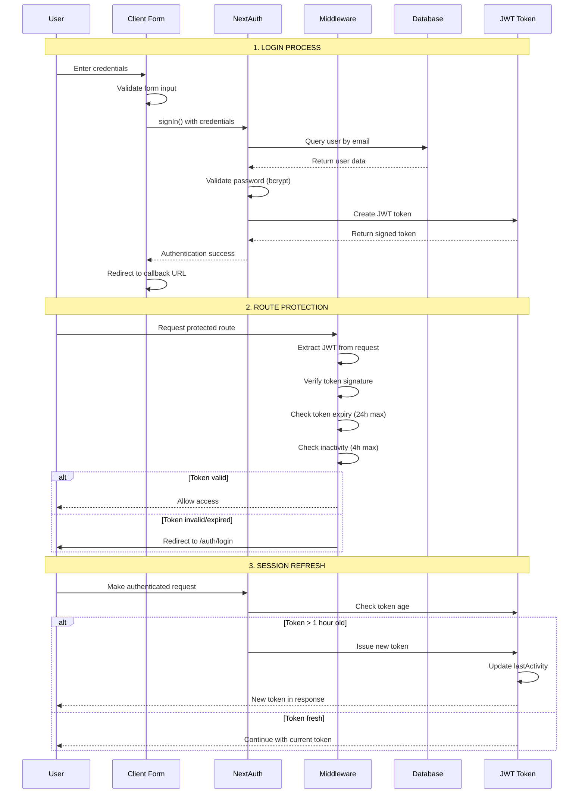
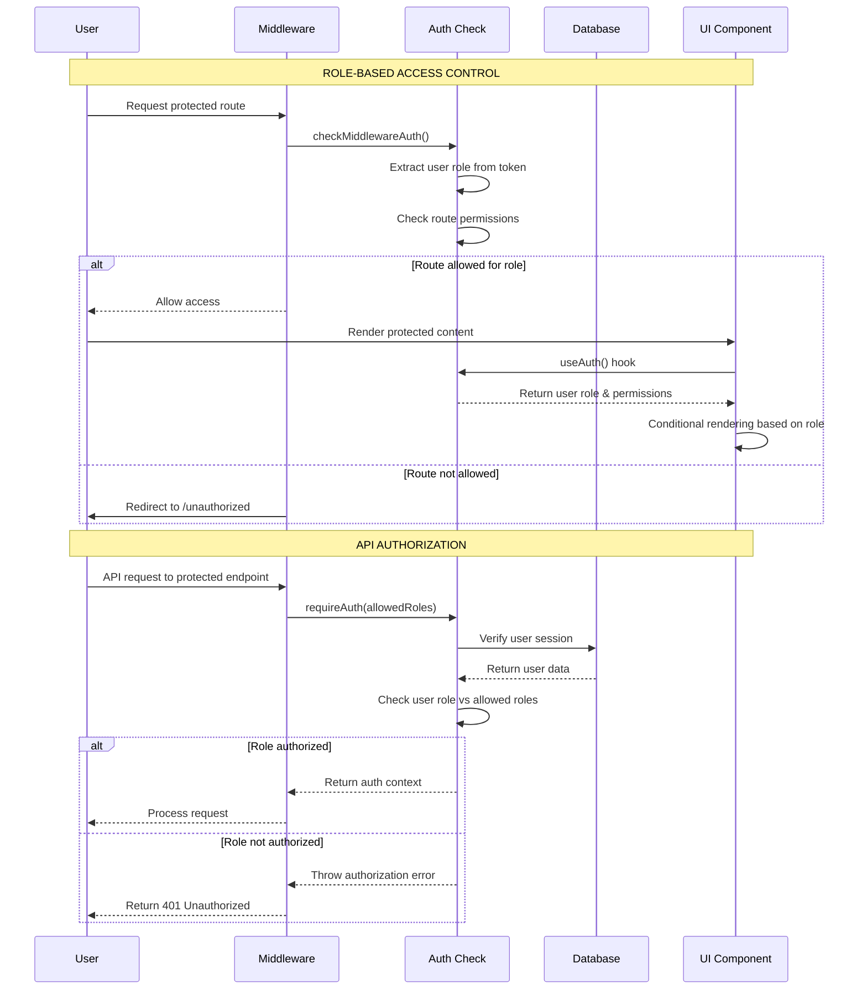
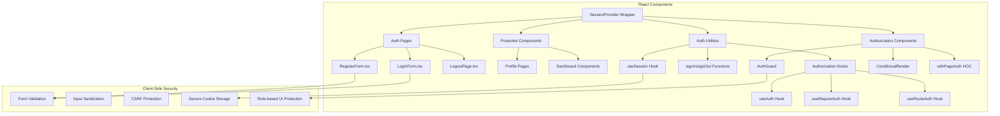
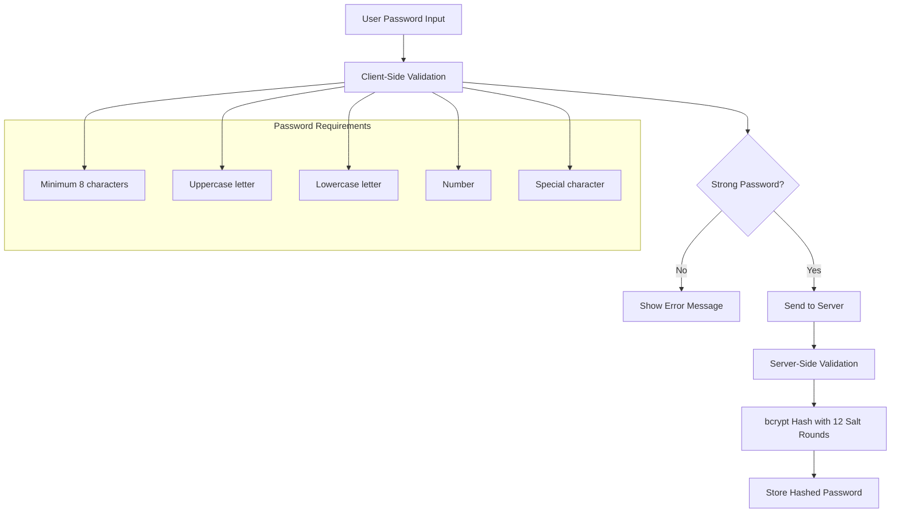
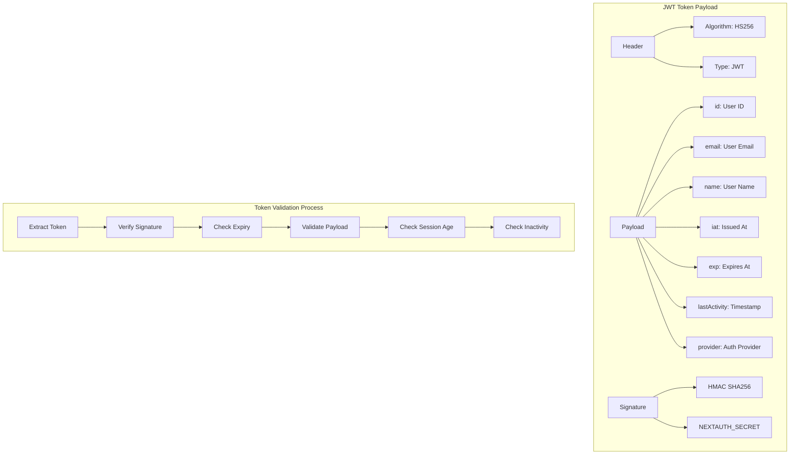
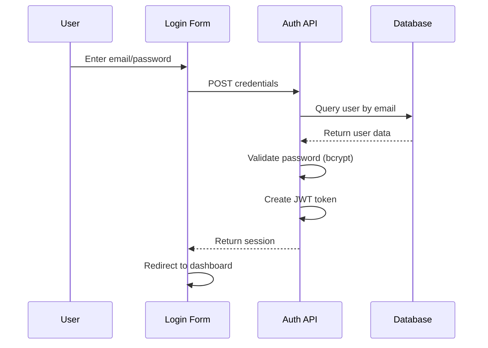
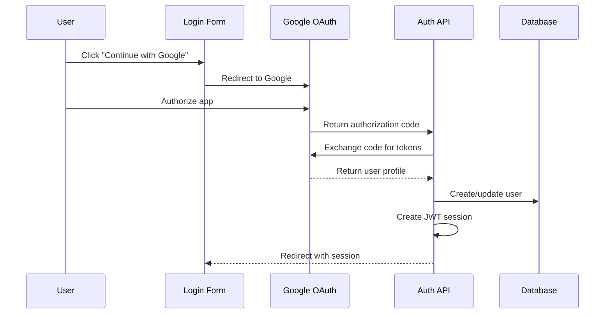
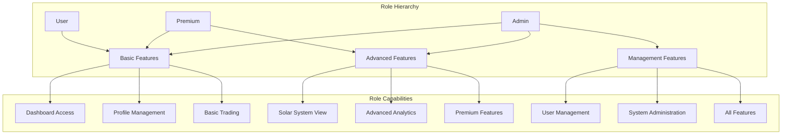
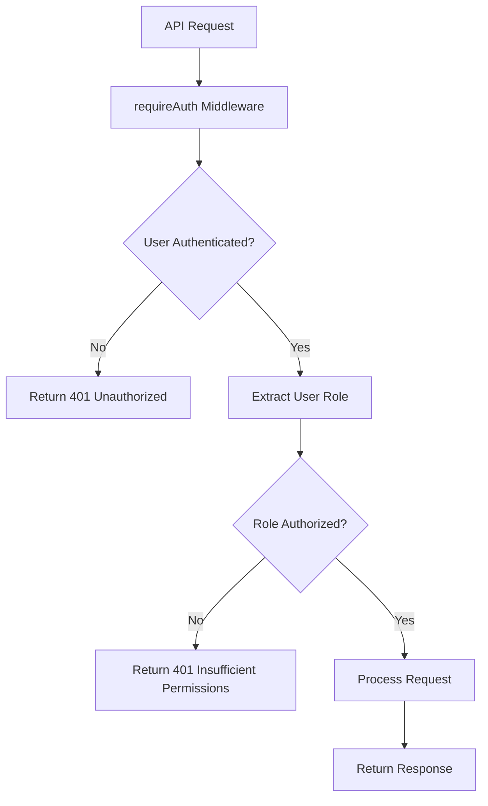

# Authentication System Architecture - Performant Trading App

## High-Level Architecture Overview

```mermaid
graph TB
    subgraph "CLIENT SIDE (Browser)"
        A[NextAuth SessionProvider] --> B[User Interface]
        B --> C[Auth Forms]
        A --> D[useSession Hook]
        E[JWT Token Storage] --> D
        E --> F[HTTP Requests]
    end

    subgraph "SERVER SIDE (Next.js)"
        subgraph "Middleware Layer"
            G[Next.js Middleware]
            G --> H[withAuth Wrapper]
            H --> I[Token Validation]
            I --> J[Session Age Check]
            J --> K[Inactivity Check]
            K --> L[Role-based Authorization]
            L --> M[Route Permission Check]
        end

        subgraph "API Layer"
            N[NextAuth API Routes]
            N --> O[Auth Providers]
            O --> P[Credentials Provider]
            O --> Q[Google OAuth Provider]
            N --> R[Protected API Routes]
            R --> S[Authorization Guards]
            T[Registration API]
        end

        subgraph "Database Layer"
            U[(Supabase PostgreSQL)]
            U --> V[users table]
            U --> W[userProfiles table]
            U --> X[accounts table]
            U --> Y[sessions table]
m            U --> Z[verification_tokens]
            U --> AA[passwords table]
        end
    end

    F --> G
    N --> U
    R --> U
    T --> U
```

## Detailed Authentication Flow Diagram



## Authorization Flow Diagram



## Component Architecture Breakdown

### Frontend (Client-Side) Components



### Backend (Server-Side) Architecture

```mermaid
graph TB
    subgraph "NextAuth Configuration"
        A[authOptions] --> B[Providers Config]
        B --> C[Credentials Provider]
        B --> D[Google OAuth Provider]

        A --> E[Session Strategy]
        E --> F[JWT Strategy]

        A --> G[Callbacks]
        G --> H[JWT Callback]
        G --> I[Session Callback]

        A --> J[Events]
        J --> K[signIn Event]
        J --> L[signOut Event]
    end

    subgraph "Authorization Layer"
        M[Authorization Config]
        M --> N[User Roles Definition]
        M --> O[Route Permissions]
        M --> P[Role Assignment Logic]

        Q[Authorization Utilities]
        Q --> R[getUserRole Function]
        Q --> S[checkRoutePermission]
        Q --> T[requireAuth Function]
    end

    subgraph "Database Schema"
        U[Drizzle ORM] --> V[User Tables]
        V --> W[users - Core auth data]
        V --> X[userProfiles - Extended data]
        V --> Y[accounts - OAuth links]
        V --> Z[sessions - DB sessions]
        V --> AA[verification_tokens]

        Note: User roles stored in users.role field (future enhancement)
    end

    subgraph "Security Layer"
        BB[Password Hashing]
        BB --> CC[bcrypt - 12 rounds]
        DD[Token Security]
        DD --> EE[JWT Signing]
        DD --> FF[Secure Headers]
        GG[Session Validation]
        GG --> HH[Age Validation]
        GG --> II[Activity Tracking]
        JJ[Authorization Security]
        JJ --> KK[Role-based Access Control]
        JJ --> LL[Permission Validation]
    end
```

## Security Implementation Details

### Password Security Flow



### JWT Token Structure and Validation



### Route Protection Matrix

| Route Pattern   | Protection Level | Required Roles       | Middleware Action    |
| --------------- | ---------------- | -------------------- | -------------------- |
| `/`             | Public           | None                 | Allow                |
| `/auth/*`       | Public           | None                 | Allow                |
| `/api/auth/*`   | Public           | None                 | Allow                |
| `/_next/*`      | Public           | None                 | Allow                |
| `/profile`      | Protected        | user, admin, premium | Require Auth + Role  |
| `/dashboard`    | Protected        | user, admin, premium | Require Auth + Role  |
| `/performance`  | Protected        | user, admin, premium | Require Auth + Role  |
| `/solar-system` | Premium          | premium, admin       | Require Premium Role |
| `/admin`        | Admin Only       | admin                | Require Admin Role   |
| `/api/user/*`   | Protected        | user, admin, premium | Require Auth + Role  |
| `/unauthorized` | Public           | None                 | Allow                |

### Session Management Timeline

```mermaid
gantt
    title Session Lifecycle Management
    dateFormat X
    axisFormat %H:%M

    section Session States
    Active Session    :active, 0, 24
    Auto Refresh      :milestone, 1
    Inactivity Warning:milestone, 20
    Inactivity Expiry :milestone, 24
    Age Expiry        :milestone, 24

    section Security Checks
    Token Validation  :0, 24
    Activity Tracking :0, 24
    Age Monitoring    :0, 24
```



## Authentication Provider Comparison

### Credentials Provider Flow



### Google OAuth Provider Flow



## Security Best Practices Implemented

### 1. Password Security

- **bcrypt hashing** with 12 salt rounds
- **Strong password requirements** enforced
- **No plaintext storage** ever

### 2. Session Security

- **JWT tokens** with secure signing
- **Automatic expiry** (24 hours max age)
- **Inactivity timeout** (4 hours max)
- **Activity tracking** on every request

### 3. Route Protection

- **Middleware-level protection** before React renders
- **Server-side validation** for API routes
- **Graceful redirects** with callback URLs

### 4. CSRF Protection

- **NextAuth built-in CSRF** protection
- **Secure cookie attributes** (httpOnly, secure, sameSite)
- **Token verification** on state-changing operations

### 5. Input Validation

- **Client-side validation** for immediate feedback
- **Server-side validation** for security
- **Type safety** with TypeScript

## Authorization Implementation Details

### User Roles and Permissions



### Authorization Components Usage

```typescript
// Route-level protection
export default withPageAuth(DashboardPage, {
  requiredRoles: ["user", "admin", "premium"],
  redirectTo: "/auth/login"
});

// Component-level protection
<AuthGuard requiredRoles={["premium", "admin"]}>
  <PremiumFeature />
</AuthGuard>

// Conditional rendering
<ConditionalRender requiredRoles={["admin"]}>
  <AdminPanel />
</ConditionalRender>

// Hook-based authorization
const { hasPermission, role } = useAuth();
if (hasPermission(["premium", "admin"])) {
  // Show premium content
}
```

### API Route Authorization Flow



This architecture provides a robust, scalable authentication and authorization system with multiple layers of security, role-based access control, and excellent user experience through automatic session management and seamless provider integration.
