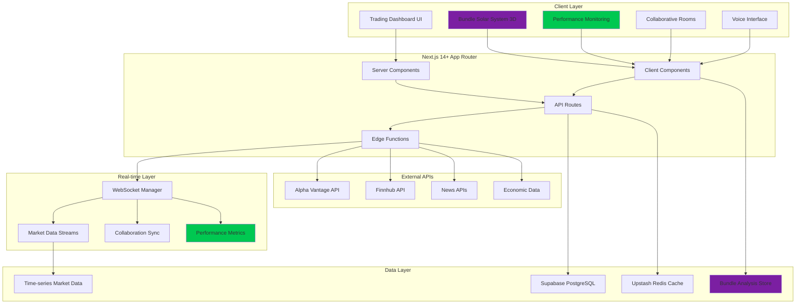

# High Level Architecture

## Technical Summary

The Performance Learning Trading Platform employs a **hybrid client-server architecture** built on Next.js 14+ App Router, designed to support both professional trading workflows and systematic performance optimization learning. The system integrates real-time financial data streaming with advanced 3D visualizations, collaborative trading rooms, and the signature Bundle Size Solar System performance learning tool.

The architecture strategically separates performance-critical trading functions (portfolio tracking, real-time data) from performance learning tools (bundle analysis, optimization demonstrations), enabling deliberate performance bottlenecks in learning components while maintaining professional-grade responsiveness in core trading features. The system scales from deliberately unoptimized baseline through six systematic optimization phases, culminating in production-ready performance suitable for professional trading platforms.

## Platform and Infrastructure Choice

**Platform:** Vercel + Supabase + Upstash for optimal Next.js integration and real-time performance

**Key Services:**
- **Vercel**: Edge deployment, performance insights, bundle analysis integration
- **Supabase**: PostgreSQL + real-time subscriptions for portfolio and social features
- **Upstash Redis**: High-performance caching for market data and session management
- **WebSocket Services**: Custom real-time infrastructure for collaborative features and market streaming

**Deployment Host and Regions:** Global edge deployment with primary regions in US-East (financial data proximity) and EU-West (global accessibility)

**Rationale:** This stack provides native performance monitoring integration essential for learning objectives while supporting enterprise-grade trading platform requirements.

## Repository Structure

**Structure:** Monorepo with performance-optimized workspace organization

**Monorepo Tool:** Turborepo for build optimization and bundle analysis integration

**Package Organization:** Feature-based separation enabling independent performance optimization and clear Bundle Size Solar System integration

```
trading-platform/
├── apps/
│   ├── web/                    # Next.js 14+ trading platform
│   └── api/                    # Standalone API services (optional)
├── packages/
│   ├── ui/                     # Shared component library
│   ├── trading-core/           # Trading logic and calculations
│   ├── performance-tools/      # Bundle analysis and optimization tools
│   └── shared/                 # Common utilities and types
```

## High Level Architecture Diagram



## Architectural Patterns

- **Hybrid Rendering Pattern**: Strategic Server/Client Component separation for optimal trading performance - *Rationale:* Trading data benefits from server-side optimization while interactive features require client-side responsiveness
- **Real-time Streaming Architecture**: WebSocket-based streaming with intelligent fallbacks for market data - *Rationale:* Financial data requires sub-second latency with reliable delivery guarantees
- **Progressive Enhancement Pattern**: Performance learning features enhance core trading without blocking functionality - *Rationale:* Maintains professional trading capability while enabling systematic performance education
- **Component-Based Microfrontend**: Modular architecture enabling independent optimization of trading vs learning features - *Rationale:* Allows deliberate performance bottlenecks in learning components without affecting trading performance
- **Event-Driven Collaboration**: Real-time collaboration using event sourcing for conflict resolution - *Rationale:* Multiple users require consistent state synchronization with performance optimization opportunities
