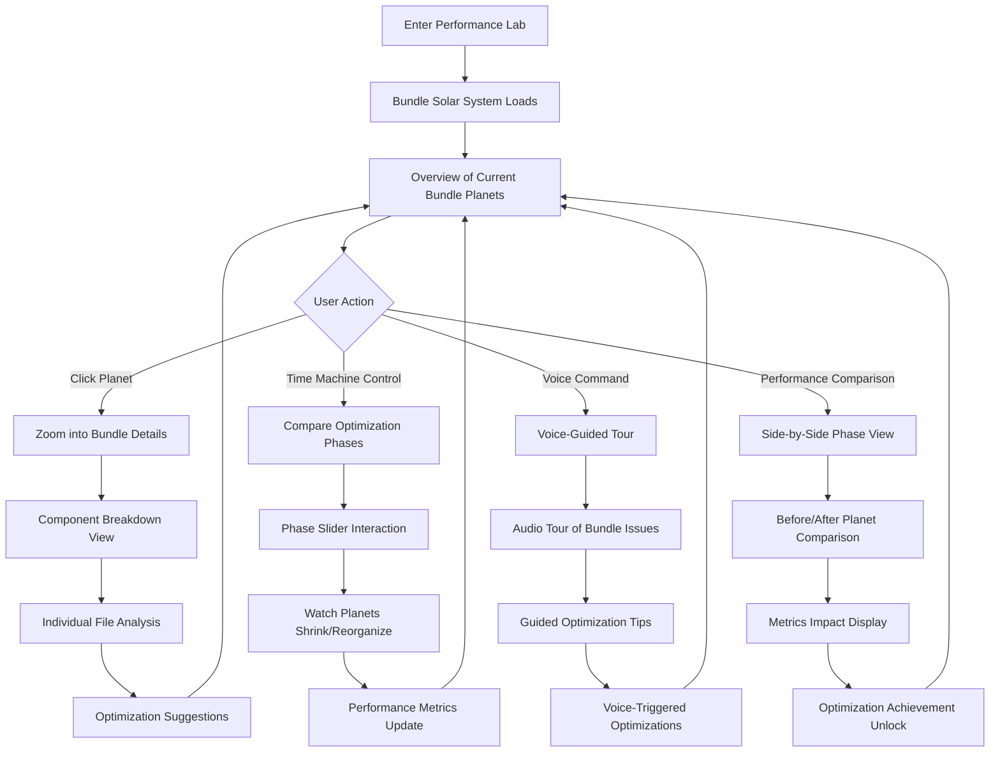
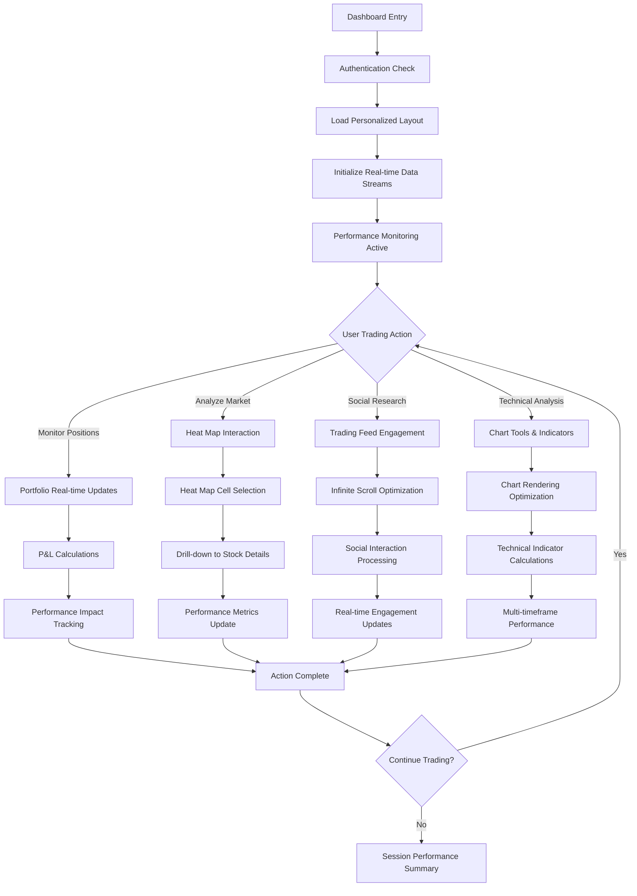
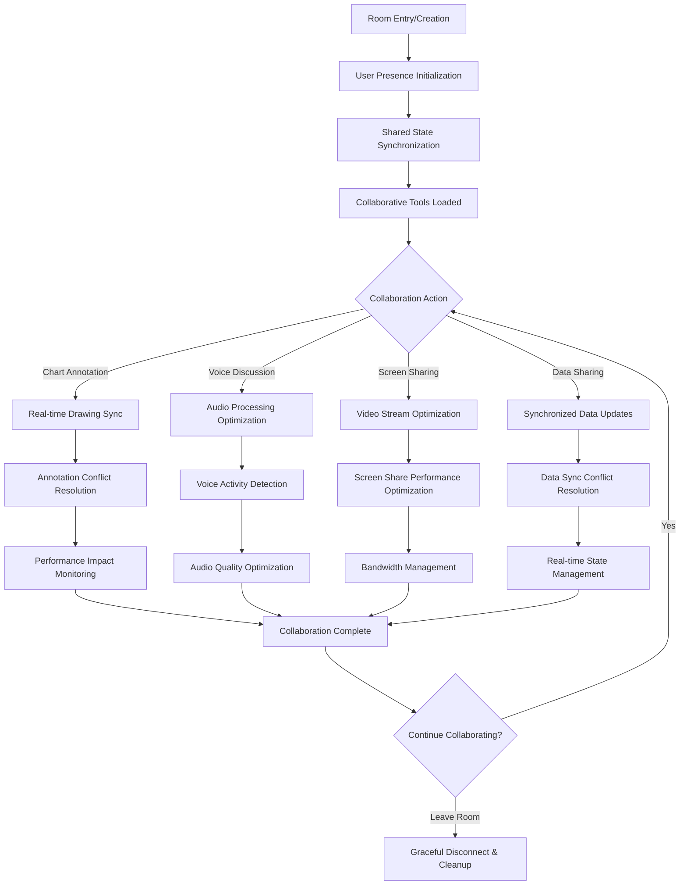
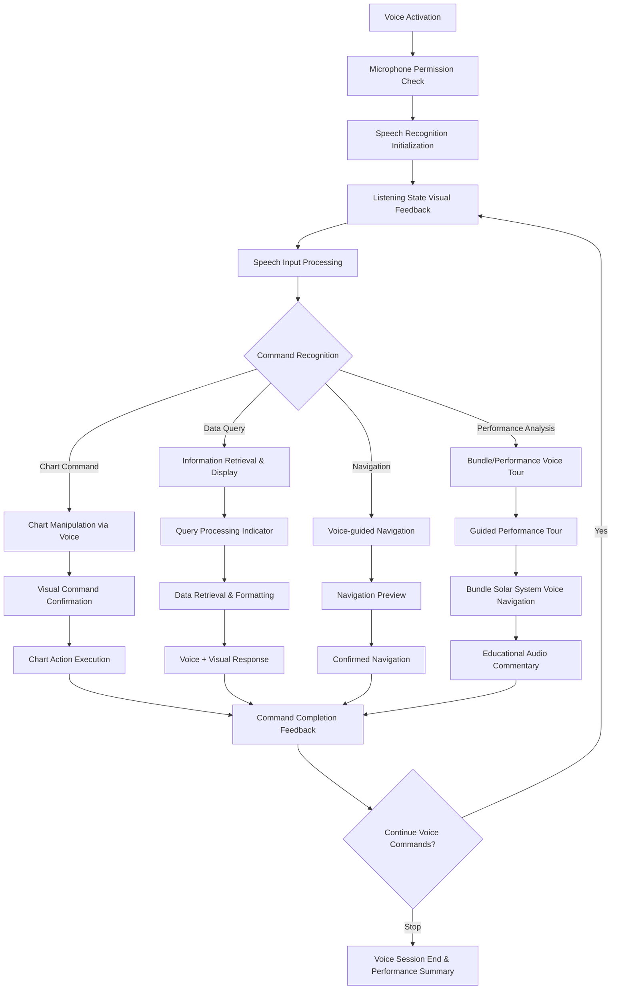

# Performance Learning Trading Dashboard UI/UX Specification

This document defines the user experience goals, information architecture, user flows, and visual design specifications for the Performance Learning Trading Dashboard's user interface. It serves as the foundation for visual design and frontend development, ensuring a cohesive and user-centered experience that supports both trading functionality and performance optimization learning objectives.

## Overall UX Goals & Principles

### Target User Personas

**Primary Persona: Performance Optimization Learner**

- Developer seeking to master web performance optimization techniques
- Preparing for job interviews requiring ARS (Application Response Speed) expertise
- Needs clear visual feedback showing optimization impact and learning progress
- Values measurable improvements and portfolio-ready documentation
- Technical background with understanding of Core Web Vitals and performance metrics

**Secondary Persona: Trading Dashboard User**

- Active trader requiring real-time market data and analysis tools
- Needs responsive, efficient interfaces for time-sensitive trading decisions
- Values collaborative features and social trading insights
- Expects professional-grade tools with minimal latency and maximum uptime
- Mobile and desktop usage patterns for different trading scenarios

### Usability Goals

**Performance-First Usability:**

- **Perceived Performance**: Interface should feel progressively faster as optimizations are applied across phases
- **Performance Transparency**: Core Web Vitals and optimization metrics should be visible and understandable to users
- **Learning Feedback**: UI should clearly demonstrate "before/after" states during optimization phases
- **Responsive Interactions**: All user actions should provide immediate visual feedback, even during heavy processing
- **Graceful Degradation**: Interface should remain functional during performance bottlenecks and optimization phases

**Trading Efficiency:**

- **Information Density**: Display maximum relevant data without overwhelming users or degrading performance
- **Quick Decision Making**: Critical trading information should be accessible within 2 clicks and load in <500ms
- **Error Prevention**: Clear validation and confirmation for trading actions with performance-optimized feedback
- **Multi-tasking Support**: Interface should support simultaneous monitoring, analysis, and social interaction
- **Mobile Trading**: Touch-optimized interfaces for mobile trading with performance considerations

### Design Principles

1. **Performance Visibility Over Hidden Optimization** - Make performance improvements visible and learnable rather than hidden behind the scenes
2. **Progressive Enhancement** - Design experiences that improve measurably with each optimization phase while maintaining core functionality
3. **Real-time Responsiveness** - Every interaction should feel immediate, with performance optimizations enhancing rather than replacing good UX patterns
4. **Collaborative Intelligence** - Social and collaborative features should feel seamless and enhance individual trading rather than distracting from it
5. **Learning-Driven Interface** - UI should teach performance concepts through visual feedback, metrics display, and optimization demonstrations

### Change Log

| Date  | Version | Description                                                  | Author            |
| ----- | ------- | ------------------------------------------------------------ | ----------------- |
| Today | 1.0     | Initial UI/UX specification for performance learning project | Sally (UX Expert) |

## Information Architecture (IA)

### Site Map / Screen Inventory

```mermaid
graph TD
    A[Main Trading Dashboard] --> B[Portfolio Management]
    A --> C[Market Analysis Hub]
    A --> D[Performance Lab]
    A --> E[Social Trading]

    B --> B1[Real-time P&L]
    B --> B2[Holdings Overview]
    B --> B3[Transaction History]

    C --> C1[Market Heat Map]
    C --> C2[Stock Charts & Analysis]
    C --> C3[3D Market Depth]
    C --> C4[Economic Calendar]

    D --> D1[Bundle Size Solar System]
    D --> D2[Core Web Vitals Dashboard]
    D --> D3[Performance Time Machine]
    D --> D4[Optimization Progress]

    E --> E1[Trading Feed]
    E --> E2[Collaborative Rooms]
    E --> E3[Voice Command Center]
    E --> E4[Social Analytics]

    A --> F[Settings & Controls]
    F --> F1[Performance Settings]
    F --> F2[Trading Preferences]
    F --> F3[Account Management]
    F --> F4[Learning Progress]
```

### Navigation Structure

**Primary Navigation:** Tab-based navigation optimized for quick switching between trading functions and performance learning features

- **Dashboard**: Main overview with customizable widgets and real-time data
- **Markets**: Market analysis tools including heat map and 3D visualizations
- **Portfolio**: Personal trading data and performance tracking
- **Social**: Community features and collaborative trading rooms
- **Performance Lab**: Bundle Size Solar System and optimization tools (unique differentiator)
- **Settings**: User preferences and performance controls

**Secondary Navigation:** Context-sensitive sidebar navigation within each primary section

- **Quick Actions**: Most frequently used functions accessible via floating action buttons
- **Performance Toggles**: One-click switching between optimized/unoptimized versions
- **Voice Commands**: Always-available voice control with visual feedback

**Breadcrumb Strategy:** Performance-aware breadcrumbs showing both location and current optimization phase

- Standard location breadcrumbs with performance context
- Optimization phase indicator (Phase 0-6) integrated into navigation
- "Time machine" controls for viewing different optimization states

## User Flows

### Bundle Size Solar System Exploration Flow

**User Goal:** Explore and understand JavaScript bundle composition and optimization impact through 3D interactive visualization

**Entry Points:** Performance Lab tab, Bundle analyzer results, or post-optimization celebration screen

**Success Criteria:** User gains clear understanding of bundle structure and appreciates optimization improvements

#### Flow Diagram

#### Edge Cases & Error Handling:

- **Large Bundle Loading**: Progressive loading with skeleton planets and loading indicators
- **WebGL Not Supported**: Graceful fallback to 2D bundle visualization with same data
- **Bundle Analysis Failure**: Clear error messaging with manual bundle upload option
- **Performance Impact**: Frame rate monitoring with automatic quality reduction if needed

**Notes:** The Bundle Size Solar System becomes the signature feature that makes the entire portfolio memorable and demonstrates advanced 3D optimization skills.

### Real-Time Trading Dashboard Flow

**User Goal:** Monitor multiple data streams and execute trading decisions efficiently while maintaining optimal performance

**Entry Points:** Main dashboard, direct symbol search, or portfolio alerts

**Success Criteria:** Complete trading workflow with <500ms response times and smooth real-time updates

#### Flow Diagram

#### Edge Cases & Error Handling:

- **Network Interruption**: Graceful offline mode with cached data and reconnection UX
- **API Rate Limiting**: Clear user feedback and intelligent request queuing
- **Performance Degradation**: Automatic feature disabling with user notification and manual override
- **Data Staleness**: Visual indicators for data age and refresh controls

### Collaborative Trading Room Flow

**User Goal:** Join or create shared trading analysis sessions with real-time collaboration features

**Entry Points:** Social tab, room invitation links, or trader profile pages

**Success Criteria:** Seamless multi-user experience with minimal latency and clear presence indicators

#### Flow Diagram

#### Edge Cases & Error Handling:

- **Connection Instability**: Robust reconnection with state recovery and user notification
- **Collaboration Conflicts**: Clear conflict resolution with user choice preservation
- **Performance Impact**: Dynamic quality adjustment based on room size and device capabilities
- **User Departure**: Smooth presence updates and abandoned annotation cleanup

### Voice Command Interaction Flow

**User Goal:** Control dashboard features through voice commands for hands-free trading analysis

**Entry Points:** Voice activation button, keyboard shortcut, or always-listening mode

**Success Criteria:** Accurate command recognition with immediate visual feedback and action execution

#### Flow Diagram

#### Edge Cases & Error Handling:

- **Speech Recognition Failure**: Clear error feedback with suggestion for manual retry
- **Ambient Noise**: Noise level indicators and adaptive sensitivity controls
- **Performance Impact**: Voice processing moved to Web Worker with performance monitoring
- **Command Ambiguity**: Clarification interface with multiple interpretation options

## Wireframes & Mockups

### Design Files

**Primary Design Files:** To be created in Figma with comprehensive performance-focused design system including Bundle Size Solar System specifications

### Key Screen Layouts

#### Main Trading Dashboard Layout

**Purpose:** Central hub combining trading functionality with performance learning visualization

**Key Elements:**

- **Top Navigation Bar**: Performance phase indicator, Core Web Vitals mini-dashboard, voice activation button
- **Left Sidebar**: Quick access to Bundle Size Solar System, performance controls, optimization toggles
- **Center Grid**: Customizable widget layout (portfolio, charts, heat map, social feed)
- **Right Panel**: Real-time performance metrics, optimization suggestions, learning progress
- **Bottom Status Bar**: Network status, data freshness indicators, collaborative presence

**Interaction Notes:** All widgets should be draggable/resizable with performance impact feedback shown during reorganization

**Design File Reference:** main-dashboard-layout-v1 (to be created)

#### Bundle Size Solar System Visualization Layout

**Purpose:** Signature 3D visualization feature for demonstrating bundle optimization mastery

**Key Elements:**

- **3D Viewport**: Central solar system with planets representing JavaScript bundles
- **Planet Information Panel**: Detailed breakdown of selected bundle with file-level analysis
- **Time Machine Controls**: Phase slider (0-6) with before/after comparison modes
- **Performance Metrics Overlay**: Real-time bundle size, loading time, and optimization impact
- **Educational Tooltips**: Contextual learning content explaining optimization concepts
- **Voice Tour Controls**: Audio guide controls with synchronized visual highlighting

**Interaction Notes:** WebGL-optimized 3D interactions with fallback to 2D visualization, performance-aware rendering quality

**Design File Reference:** bundle-solar-system-v1 (to be created)

#### Collaborative Trading Room Layout

**Purpose:** Multi-user shared workspace with real-time synchronization and performance optimization

**Key Elements:**

- **Shared Chart Canvas**: Large collaborative charting area with multi-user annotations
- **User Presence Panel**: Real-time user avatars with activity indicators and performance status
- **Voice Chat Controls**: Audio controls with performance-optimized processing indicators
- **Annotation Toolbar**: Drawing tools with real-time sync and conflict resolution UI
- **Performance Dashboard**: Room-level performance metrics showing collaborative feature impact
- **Room Settings**: Performance quality controls and collaboration feature toggles

**Interaction Notes:** Real-time cursor tracking, annotation syncing with performance optimization, graceful degradation for poor connections

**Design File Reference:** collaborative-room-v1 (to be created)

#### Performance Learning Dashboard Layout

**Purpose:** Educational interface showing optimization progress and teaching performance concepts

**Key Elements:**

- **Core Web Vitals Timeline**: Historical performance metrics with optimization milestone markers
- **Before/After Comparison Grid**: Side-by-side views of unoptimized vs optimized features
- **Learning Progress Tracker**: Gamified progress through performance optimization concepts
- **Code Impact Visualizer**: Before/after code snippets with performance impact analysis
- **Achievement Gallery**: Unlocked performance milestones with portfolio-ready documentation
- **Export Tools**: One-click generation of performance reports for interview presentations

**Interaction Notes:** Interactive performance comparisons, exportable metrics, and portfolio presentation mode

**Design File Reference:** performance-learning-dashboard-v1 (to be created)

## Component Library / Design System

### Design System Approach

**Performance-First Component Library:** Create a custom component library optimized for both trading functionality and performance learning visualization. Components will be designed with built-in performance monitoring and optimization showcases, supporting the dual learning and trading objectives.

### Core Components

#### Performance Visualization Components

**PerformanceMetricsWidget**
**Purpose:** Real-time Core Web Vitals display with historical trends and optimization impact visualization

**Variants:**

- Compact (header display)
- Detailed (dashboard widget)
- Comparison (before/after optimization)

**States:** Loading, real-time updating, error, offline

**Usage Guidelines:** Always visible during performance learning phases, can be minimized during pure trading focus

#### BundleSolarSystemViewer

**Purpose:** Interactive 3D visualization of JavaScript bundle composition with optimization journey display

**Variants:**

- Full 3D immersive view
- 2D fallback with same data representation
- Miniature overview widget

**States:** Loading 3D assets, rendering, interactive, comparison mode, educational tour mode

**Usage Guidelines:** Central feature for demonstrating bundle optimization expertise, requires WebGL capability detection

#### OptimizationTimeSlider

**Purpose:** Time machine control allowing users to experience different optimization phases

**Variants:**

- Horizontal slider with phase markers
- Vertical timeline with detailed milestones
- Circular progress with phase indicators

**States:** Phase transition, comparison mode, locked (during active optimization)

**Usage Guidelines:** Should be accessible from any screen to demonstrate optimization progression

#### Trading Data Components

**RealTimeDataTable**
**Purpose:** High-performance data table with virtualization and real-time updates for market data

**Variants:**

- Compact (portfolio overview)
- Detailed (full market screener)
- Performance comparison (optimized vs unoptimized)

**States:** Loading, real-time streaming, paused updates, error recovery, performance degraded

**Usage Guidelines:** Demonstrates virtualization and data optimization techniques while providing trading functionality

#### InteractiveFinancialChart

**Purpose:** High-performance charting component with collaborative features and optimization showcases

**Variants:**

- Basic candlestick
- Advanced with indicators
- Collaborative with multi-user annotations
- Performance comparison view

**States:** Data loading, rendering, interactive, collaborative mode, performance monitoring

**Usage Guidelines:** Core trading feature that showcases chart rendering optimization from heavy initial implementation to optimized Canvas/WebGL

#### Social & Collaboration Components

**CollaborativeCursor**
**Purpose:** Real-time cursor tracking for collaborative trading rooms with performance optimization

**Variants:**

- Basic cursor with username
- Advanced with user avatar and activity status
- Performance-optimized with throttling indicators

**States:** Connected, disconnected, idle, active annotation

**Usage Guidelines:** Demonstrates real-time collaboration optimization techniques

#### VoiceCommandInterface

**Purpose:** Voice control visualization with performance feedback and Web Worker optimization demonstration

**Variants:**

- Compact activation button
- Full voice dashboard with waveform visualization
- Performance monitoring with processing time display

**States:** Inactive, listening, processing, command recognized, error

**Usage Guidelines:** Accessibility-first design with performance optimization showcase through Web Worker implementation

#### Learning & Educational Components

**PerformanceAchievementBadge**
**Purpose:** Gamified progress tracking for performance optimization milestones

**Variants:**

- Individual achievement
- Progress collection
- Comparison showcase

**States:** Locked, unlocked, highlighted (recent achievement)

**Usage Guidelines:** Motivational elements that make performance learning engaging and portfolio-presentable

#### OptimizationComparisonPanel

**Purpose:** Side-by-side before/after visualization for any optimized feature

**Variants:**

- Code comparison
- Performance metrics comparison
- Visual UI comparison
- Interactive demo comparison

**States:** Before view, after view, transition animation, interactive comparison

**Usage Guidelines:** Essential for demonstrating optimization impact in interviews and portfolio presentations

## Branding & Style Guide

### Visual Identity

**Brand Guidelines:** Performance-First Financial Technology with Educational Excellence theme

**Design Philosophy:**

- **Performance Visibility**: Design elements should make performance concepts tangible and beautiful
- **Professional Trading**: Maintain credibility as a serious financial technology interface
- **Learning Innovation**: Visual system that teaches performance concepts through design
- **Portfolio Excellence**: Every visual choice supports interview presentation and technical demonstration

### Color Palette

| Color Type             | Hex Code | Usage                                                              |
| ---------------------- | -------- | ------------------------------------------------------------------ |
| **Performance Green**  | #00C851  | Optimized states, good performance metrics, achievement indicators |
| **Performance Red**    | #FF4444  | Unoptimized states, poor performance metrics, bottleneck warnings  |
| **Performance Amber**  | #FF8800  | Optimization in progress, moderate performance, attention needed   |
| **Trading Blue**       | #1976D2  | Primary trading actions, buy signals, portfolio gains              |
| **Trading Crimson**    | #D32F2F  | Sell signals, portfolio losses, critical alerts                    |
| **Bundle Purple**      | #7B1FA2  | Bundle Size Solar System planets, 3D visualization elements        |
| **Collaboration Teal** | #00ACC1  | Social features, collaborative elements, user presence             |
| **Voice Indigo**       | #3F51B5  | Voice control features, audio processing, accessibility            |
| **Background Dark**    | #121212  | Primary dark theme background for trading focus                    |
| **Background Light**   | #FAFAFA  | Secondary light theme for learning and documentation               |
| **Text Primary**       | #FFFFFF  | High contrast text for dark themes                                 |
| **Text Secondary**     | #212121  | Primary text for light themes                                      |
| **Text Muted**         | #757575  | Secondary information, timestamps, metadata                        |

### Typography

#### Font Families

- **Primary**: Inter (trading interface, performance metrics, professional presentation)
- **Secondary**: JetBrains Mono (code snippets, technical details, bundle analysis)
- **Display**: Lexend (headings, achievement badges, learning milestones)

#### Type Scale

| Element               | Size     | Weight | Line Height |
| --------------------- | -------- | ------ | ----------- |
| **H1 Display**        | 2.5rem   | 700    | 1.2         |
| **H2 Section**        | 2rem     | 600    | 1.3         |
| **H3 Component**      | 1.5rem   | 600    | 1.4         |
| **Body Trading**      | 1rem     | 400    | 1.5         |
| **Body Small**        | 0.875rem | 400    | 1.4         |
| **Code/Metrics**      | 0.875rem | 500    | 1.6         |
| **Performance Label** | 0.75rem  | 600    | 1.3         |

### Iconography

**Icon Library:** Lucide React for consistent, performance-optimized icons with custom additions for trading and performance concepts

**Custom Icon Categories:**

- **Performance Icons**: Speedometer variants, optimization symbols, Core Web Vitals representations
- **Trading Icons**: Chart types, order symbols, portfolio indicators
- **3D/Bundle Icons**: Planet symbols, solar system elements, bundle representations
- **Learning Icons**: Achievement badges, progress indicators, educational symbols

**Usage Guidelines:**

- Performance icons use color coding (green/amber/red) to indicate optimization states
- Trading icons maintain professional financial industry standards
- Custom Bundle Solar System icons create unique visual language for portfolio presentation

### Spacing & Layout

**Grid System:** 8px base unit grid system optimized for both trading data density and performance learning clarity

**Performance-Aware Spacing:**

- **Compact Mode** (optimized state): Tighter spacing for data density, 8px/16px rhythm
- **Learning Mode** (educational state): Generous spacing for clarity, 16px/24px rhythm
- **Presentation Mode** (portfolio demo): Expanded spacing for visibility, 24px/32px rhythm

**Spacing Scale:**

- **xs**: 4px (fine adjustments, borders)
- **sm**: 8px (component padding, small gaps)
- **md**: 16px (standard spacing, component margins)
- **lg**: 24px (section spacing, large gaps)
- **xl**: 32px (page sections, major layout spacing)
- **xxl**: 48px (hero sections, presentation spacing)

**Trading Dashboard Specific:**

- **Data Tables**: Minimum 4px row padding for readability with performance optimization
- **Chart Containers**: 16px padding with performance metrics overlay space
- **Widget Spacing**: 8px gaps in compact mode, 16px in standard mode
- **Performance Overlays**: 24px minimum spacing from content for clear performance visibility

### Performance Visualization Design Language

**Bundle Size Solar System Aesthetics:**

- **Planet Styling**: Metallic gradients with size-based glow effects
- **Orbit Paths**: Subtle animated trails showing dependency relationships
- **Background**: Deep space aesthetic with subtle particle effects (performance permitting)
- **Interactive Elements**: Hover states with information overlays and smooth transitions
- **Size Scaling**: Logarithmic scaling for bundle sizes with clear visual hierarchy

**Performance State Visual Language:**

- **Optimized State**: Clean, bright, smooth animations with green accent lighting
- **Unoptimized State**: Cluttered, dim, choppy animations with red warning indicators
- **Transition State**: Progressive visual improvement with amber progress indicators
- **Error State**: Clear diagnostic overlays with actionable improvement suggestions

## Accessibility Requirements

### Compliance Target

**Standard:** WCAG 2.1 AA compliance maintained throughout all optimization phases with enhanced focus on performance-accessible design patterns

### Key Requirements

**Visual:**

- **Color contrast ratios**: Minimum 4.5:1 for all text, 3:1 for large text and interactive elements
- **Performance color coding**: Alternative indicators beyond color (icons, patterns, animations) for performance states
- **Focus indicators**: High-contrast focus rings with 2px minimum thickness, performance-optimized animations
- **Text sizing**: Minimum 16px for body text, scalable up to 200% without horizontal scrolling or functionality loss
- **Bundle Solar System accessibility**: Alternative text descriptions and keyboard navigation for 3D space exploration

**Interaction:**

- **Keyboard navigation**: Full keyboard access to all features including 3D Bundle Solar System with spatial navigation
- **Screen reader support**: Comprehensive ARIA labels and live regions for real-time data updates and performance metrics
- **Touch targets**: Minimum 44px touch targets for all interactive elements, optimized for mobile trading workflows
- **Voice control accessibility**: Voice commands provide alternative input method for motor-impaired users with visual feedback
- **Performance feedback**: Accessible alternatives for performance visualizations (audio cues, haptic feedback where available)

**Content:**

- **Alternative text**: Comprehensive alt text for all performance charts, Bundle Solar System elements, and data visualizations
- **Heading structure**: Logical H1-H6 hierarchy with performance context preserved in screen reader navigation
- **Form labels**: Clear, descriptive labels for all trading forms and performance configuration controls
- **Real-time updates**: ARIA live regions for streaming data with performance-optimized update frequency
- **Educational content**: Screen reader accessible explanations for all performance optimization concepts

### Testing Strategy

**Accessibility Testing Integration:** Multi-phase testing approach that validates accessibility throughout performance optimization phases

**Testing Tools:**

- **Automated Testing**: axe-core integration with CI/CD pipeline and performance budget inclusion
- **Manual Testing**: Keyboard navigation testing with performance impact monitoring
- **Screen Reader Testing**: NVDA, JAWS, and VoiceOver compatibility across all optimization phases
- **Performance Accessibility**: Ensure accessibility features don't negatively impact Core Web Vitals

**Testing Process:**

- **Phase 0 Baseline**: Establish accessibility baseline alongside performance baseline
- **Optimization Impact**: Verify accessibility preservation during each performance optimization phase
- **Advanced Features**: Specialized testing for 3D visualization, voice control, and collaborative features
- **Portfolio Readiness**: Accessibility demonstration capabilities for interview presentations

## Responsiveness Strategy

### Breakpoints

| Breakpoint  | Min Width | Max Width | Target Devices                                   |
| ----------- | --------- | --------- | ------------------------------------------------ |
| **Mobile**  | 320px     | 767px     | Smartphones, compact trading on mobile           |
| **Tablet**  | 768px     | 1023px    | iPads, surface tablets, collaborative trading    |
| **Desktop** | 1024px    | 1439px    | Standard trading workstations, main development  |
| **Wide**    | 1440px    | -         | Ultra-wide monitors, multi-screen trading setups |

### Adaptation Patterns

**Layout Changes:**

- **Mobile**: Single-column layout with tabbed navigation, simplified Bundle Solar System (2D mode preferred)
- **Tablet**: Two-column layout with collapsible sidebars, touch-optimized Bundle Solar System controls
- **Desktop**: Multi-column dashboard with full 3D Bundle Solar System and all performance tools
- **Wide**: Multi-screen support with dedicated performance monitoring displays and expanded solar system view

**Navigation Changes:**

- **Mobile**: Bottom tab navigation with performance quick-access drawer
- **Tablet**: Side navigation with performance metrics in header
- **Desktop**: Full navigation with persistent performance monitoring sidebar
- **Wide**: Multi-panel navigation with dedicated performance workspace

**Content Priority:**

- **Mobile**: Core trading functions prioritized, Bundle Solar System accessible via dedicated performance tab
- **Tablet**: Balanced trading and performance learning with touch-optimized 3D controls
- **Desktop**: Full feature access with optimal Bundle Solar System experience
- **Wide**: Enhanced multi-tasking with simultaneous performance comparison views

**Interaction Changes:**

- **Mobile**: Touch-first interactions with voice control enhancement, simplified 3D navigation gestures
- **Tablet**: Touch + stylus support for collaborative features, medium-complexity 3D interactions
- **Desktop**: Mouse precision for detailed Bundle Solar System exploration and complex performance analysis
- **Wide**: Multi-cursor support for collaborative rooms, advanced keyboard shortcuts for power users

### Performance Responsiveness Integration

**Mobile Performance Adaptations:**

- **Bundle Solar System**: Automatic 2D fallback with touch-optimized planet exploration
- **Real-time Data**: Reduced update frequency to preserve battery and performance
- **Heat Map**: Simplified grid with fewer cells, optimized for touch interaction
- **Social Feed**: Aggressive virtualization with touch-optimized infinite scroll

**Performance Budget by Device:**

- **Mobile**: LCP <2.5s, FID <200ms (accounting for lower-powered devices)
- **Tablet**: LCP <2.0s, FID <150ms (balanced performance expectations)
- **Desktop**: LCP <1.5s, FID <100ms (optimal performance targets)
- **Wide**: LCP <1.0s, FID <50ms (enhanced performance for professional use)

## Animation & Micro-interactions

### Motion Principles

**Performance-Conscious Animation Design:** All animations should demonstrate performance optimization concepts while providing smooth, professional user experience that enhances rather than hinders trading workflows.

**Core Animation Philosophy:**

- **Purposeful Motion**: Every animation should serve a functional purpose (feedback, guidance, state indication) or educational purpose (performance demonstration)
- **Performance Teaching**: Animation quality should visibly improve across optimization phases, teaching GPU acceleration and RAF optimization
- **Professional Restraint**: Maintain trading platform credibility with subtle, efficient animations that support decision-making
- **Accessibility First**: All animations respect prefers-reduced-motion settings with educational alternatives

### Key Animations

**Bundle Size Solar System Animations:**

- **Planet Rotation**: Subtle rotation with size-based angular velocity (larger bundles rotate slower) - Duration: Continuous, Easing: Linear
- **Orbit Mechanics**: Realistic orbital motion showing bundle dependencies - Duration: 10-30s cycles, Easing: Bezier curves
- **Zoom Transitions**: Smooth camera movement for planet exploration - Duration: 800ms, Easing: ease-out-expo
- **Phase Transformation**: Morphing animation showing optimization progression - Duration: 2000ms, Easing: ease-in-out-cubic
- **Interactive Hover**: Glow effects and information panel animations - Duration: 200ms, Easing: ease-out

**Performance State Transitions:**

- **Optimization Progress**: Loading bars with particle effects showing improvement - Duration: Variable based on actual optimization time, Easing: ease-out
- **Metric Improvements**: Counter animations for Core Web Vitals improvements - Duration: 1500ms, Easing: ease-out-quart
- **Before/After Reveals**: Smooth transitions between unoptimized and optimized states - Duration: 1000ms, Easing: ease-in-out-quad
- **Achievement Unlocks**: Celebration animations for performance milestones - Duration: 2000ms, Easing: elastic-out

**Trading Interface Animations:**

- **Real-time Data Updates**: Smooth value transitions without jarring jumps - Duration: 300ms, Easing: ease-out
- **Chart Rendering**: Progressive chart drawing with performance-optimized rendering - Duration: 800ms, Easing: ease-out-cubic
- **Heat Map Color Transitions**: Smooth color interpolation for market changes - Duration: 500ms, Easing: ease-in-out
- **Portfolio Changes**: Gentle highlighting for P&L updates - Duration: 400ms, Easing: ease-out

**Collaborative Features:**

- **User Presence**: Fade in/out for user joins/leaves - Duration: 300ms, Easing: ease-out
- **Cursor Tracking**: Smooth interpolation for real-time cursor positions - Duration: 100ms, Easing: linear
- **Annotation Sync**: Drawing stroke animations for shared annotations - Duration: Real-time, Easing: Based on user input timing
- **Voice Activity**: Pulse animations for active speakers - Duration: 1000ms cycle, Easing: ease-in-out-sine

### Performance Animation Optimization

**GPU Acceleration Strategy:**

- **Phase 0-2**: CSS-based animations with deliberate layout thrashing for learning
- **Phase 3-4**: Transform-only animations with GPU acceleration
- **Phase 5-6**: Advanced techniques using requestAnimationFrame and Web Animations API

**Frame Rate Management:**

- **Performance Monitoring**: Real-time FPS display during animations
- **Adaptive Quality**: Automatic animation complexity reduction based on device performance
- **Budget Enforcement**: Animation performance budgets with automatic fallbacks

**Educational Animation Features:**

- **Performance Comparison Mode**: Side-by-side animation quality comparison (optimized vs unoptimized)
- **FPS Visualization**: Real-time frame rate overlay during complex animations
- **Animation Profiling**: Built-in animation performance analysis tools

## Performance Considerations

### Performance Goals

**Learning-Driven Performance Targets:** Performance goals that support educational objectives while achieving professional-grade results

**Phase-Based Performance Progression:**

- **Phase 0 (Baseline)**: Deliberately poor performance - LCP >4s, FID >300ms, CLS >0.25
- **Phase 1-2 (Initial Optimization)**: Noticeable improvement - LCP 2.5-4s, FID 200-300ms, CLS 0.15-0.25
- **Phase 3-4 (Core Optimization)**: Good performance - LCP 1.5-2.5s, FID 100-200ms, CLS 0.1-0.15
- **Phase 5-6 (Advanced Optimization)**: Excellent performance - LCP <1.5s, FID <100ms, CLS <0.1

### Design Strategies

**UI Performance Strategy:** Design decisions that support performance learning while maintaining user experience quality

**Bundle Size Solar System Performance:**

- **Progressive Complexity**: Start with simple 3D geometry, add detail during optimization phases
- **LOD (Level of Detail)**: Automatic quality adjustment based on viewing distance and device capabilities
- **Performance Budgets**: 60fps target for 3D interactions with graceful degradation
- **Memory Management**: Automatic texture and geometry cleanup with visual memory usage indicators

**Real-time Data Performance:**

- **Update Batching**: Group real-time updates to minimize layout thrashing with educational timing controls
- **Selective Rendering**: Only update visible components with performance impact visualization
- **Data Normalization**: Optimize data structures for React performance with before/after comparisons
- **Background Processing**: Web Workers for heavy calculations with educational processing time display

**Collaborative Features Performance:**

- **Connection Optimization**: Intelligent WebSocket management with connection status visualization
- **State Synchronization**: Efficient diff-based updates with conflict resolution performance tracking
- **Real-time Throttling**: Smart update frequency management with user-controlled performance settings
- **Presence Optimization**: Efficient user tracking with minimal bandwidth impact and usage analytics display

## Next Steps

### Immediate Actions

1. **Create Figma design system** with performance-focused component library and Bundle Size Solar System detailed specifications
2. **Validate Bundle Solar System 3D requirements** with Three.js feasibility testing and WebGL compatibility assessment
3. **Prototype voice command interface** to validate Web Speech API capabilities and performance optimization opportunities
4. **Test collaborative real-time features** using basic WebSocket implementation to understand performance optimization challenges
5. **Document performance baseline requirements** for measuring optimization improvements across all 6 phases

### Design Handoff Checklist

- [ ] All user flows documented with performance considerations and optimization opportunities
- [ ] Component inventory complete with performance-aware variants and educational states
- [ ] Accessibility requirements defined with performance optimization compatibility
- [ ] Responsive strategy clear with device-specific performance targets and adaptation patterns
- [ ] Brand guidelines incorporated with performance state visual language and portfolio presentation standards
- [ ] Performance goals established with measurable targets and learning milestone integration
- [ ] Bundle Size Solar System specifications detailed with 3D interaction patterns and educational features
- [ ] Animation strategy documented with performance teaching methodology and optimization progression

## Checklist Results

_UI/UX checklist validation to be performed by UX Expert_

---

**🎨 UI/UX Specification Complete!**

This comprehensive specification provides the foundation for creating a portfolio-worthy trading dashboard that brilliantly demonstrates performance optimization expertise through the innovative Bundle Size Solar System and systematic optimization progression. The design balances professional trading interface requirements with cutting-edge performance learning tools, creating a unique project that will stand out in any technical interview.
